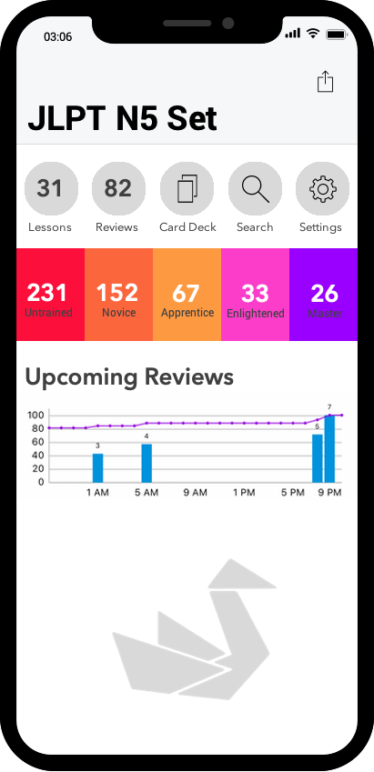

# Tsuru
### A Spaced Repetition System (SRS) iOS Application for Japanese Vocabulary


Tsuru is an in-development iPhone/iPad application that will become avaliable to the App Store for free. The app makes learning Japanese extremely easy and efficient. Tsuru uses a SRS algorithm called [Leitner's System](https://en.wikipedia.org/wiki/Leitner_system) to test you only on the Japanese vocabulary that you are about to forget. This method drastically optimizes studying by helping learners skip the material he or she can already reliably recall. Other applications like Anki, Cleverdeck, and Flashcards Deluxe successfully utilize this method. However, these applications are not gear towards Japanese and does not have the additional features that could enchance learning. Tsuru specializes in Kanji and will test you on your handwritting along with your vocabulary. In addition, Tsuru is fun and will keep learners motivated with the level system that is implementent in the app!

## App Overview

### Splash Screen


</br>
</br>
</br>
</br>
</br>
</br>
</br>
</br>
</br>
</br>
</br>
</br>

### Card Set Screen

When you open Tsuru, the user will be directed to the Card Set Screen. In this screen, the user can see which set he or she is currently studying. The user can switch from sets by tapping on the Settings button. To save and export the data, the user can tap on the action button on the top right hand corner. Send your data to an email address, through air drop, or simply through another Tsuru app. The graph represents how many avalible review questions are there. Since Tsuru is a SRS application, questions only become avavlible after a certain amount of time. Tap on the Review button to start a review session. The Lesson button will introduce users to new and unfamilair words. After the user completes the lessons, he or she will view them in the reviews. The Card Deck button will bring you to a screen with all the cards in the current set. And the Search button will search for a word or phrase in the currect deck.


</br>
</br>
</br>
</br>
</br>
</br>
</br>
</br>
</br>
</br>
</br>
</br>

## What makes Tsuru effective?

### Menmonics & SRS

Tsuru allows you to add mnemonics to every vocabulary word. Waste less time! Memorize and recall way more. Studies have proven the effectiveness of menmonics, especially for foreign-language acquisition. Combine this with Tsuru's spaced repetition system and you should be learning in no time.

</br>
</br>
</br>
</br>
</br>
</br>

### Kanji & Machine Learning

Tsuru helps you practice Kanji by writing it down, and showing you the stroke order. Compatiable with Apple Pencil or just your finger, Tsuru utilizes machine learning technology in order to regonize handwritten text. For Kanji beginers, enable or disable furigana on flashcards anytime.

</br>
</br>
</br>
</br>
</br>
</br>

### Levels

Tsuru utilizes a level system to help users stay motivated with learning Japanese! Tsuru includes five levels from novice to master. Level up and compete with freinds!

</br>
</br>
</br>
</br>
</br>
</br>

### Premade Sets

Tsuru includes premade sets to help you jump right into learning. JPTL flashcards, Genki flashcards, and other Japanese learning courses will be avalible without any inital setup. Tsuru also allows users to create their own sets or add flashcards to already existing ones!

</br>
</br>
</br>
</br>
</br>
</br>

## How Does Tsuru Work?

### Database
Unlike other SRS applications, Tsuru is uses local storage on the device and does not require users to create accounts. Data can be backed up on a cloud or can be transfered between devices. Do to this, Tsuru will utilize [Realm](https://realm.io/), an excellent framework for iOS database management. The primary data structure that will be utilized in Tsuru is the card set which can be seen below. Each card set will three dictionaries. The first dictionary can identify a vocabulary word to a corresponding card identifier. The second dictionary can identify a definition to a corresponding card identifier. And the third dictionary contains the card object's along with the IDs. This data structure utilizes a Bi-directional Dictionary to decrease lookup time and increase effientcy of the application.

```swift
class CardSet {
  var cardDict: [UUID: Card] = [:]
  var vocabularyDict: [String: UUID] = [:]
  var definitionDict: [String: UUID] = [:]
}
```

Each card object is structured below. Note: A Japanese Vocabulary object contains the term, kanji, furigana, and romaji of each word.

```swift
class Card {
  var id: UUID = UUID()
  var vocabulary: JapaneseVocabulary
  var definition: String
  var vocabularySynonyms: [JapaneseVocabulary] = []
  var definitionSynonyms: [String] = []
  var dateCreated: NSDate = NSDate()
  var availableDate: NSDate?
  var level: Int = 0
  var partOfSpeech: String = ""
  var mnenomic: String?
  var notes: String?
}
```

### Hand Written Character Recongition
Tsuru can recongize japanese characters the user writes in the application. This is done with machine learning technogolies and can be utlized for free with a third party framewrok called [Zinnia](http://taku910.github.io/zinnia/).

### Furigana
Tsuru can fetch furigana for Kanji vocabuary and place readings on flashcards. This can be done by sending over the vocabuary term to [Yahoo! Japan's Furigana Service API](https://developer.yahoo.co.jp/webapi/jlp/furigana/v1/furigana.html) and getting the returned result. 
