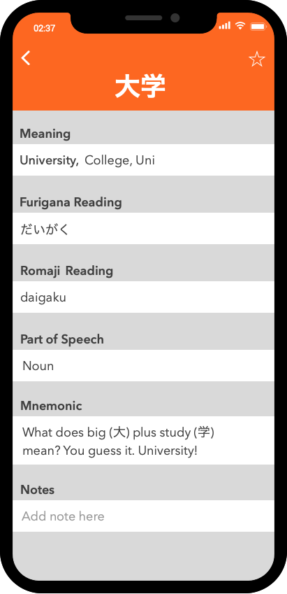

# Tsuru
### A Spaced Repetition System (SRS) iOS Application for Japanese Vocabulary


Tsuru is an in-development iPhone/iPad application that will become available to the App Store for free. The app makes learning Japanese extremely easy and efficient. Tsuru uses a SRS algorithm called [Leitner's System](https://en.wikipedia.org/wiki/Leitner_system) to test you only on the Japanese vocabulary that you are about to forget. This method drastically optimizes studying by helping learners skip the material he or she can already reliably recall. Other applications like Anki, Cleverdeck, and Flashcards Deluxe successfully utilize this method. However, these applications are not gear towards Japanese and does not have the additional features that could enhance learning. Tsuru specializes in Kanji and will test you on your handwriting along with your vocabulary. In addition, Tsuru is fun and will keep learners motivated with the level system that is implemented in the app!

## App Overview

### Splash Screen


</br>
</br>
</br>
</br>
</br>
</br>
</br>
</br>
</br>
</br>
</br>
</br>
</br>
</br>

### Card Set Screen

When you open Tsuru, the user will be directed to the Card Set Screen. In this screen, the user can see which set he or she is currently studying. The user can switch from sets by tapping on the Settings Button. To save and export the data, the user can tap on the Action Button on the top right-hand corner. He or she can then send the data to an email address, through air drop, or simply through another Tsuru app. The graph on the screen represents displays how many available review questions there will be during a certain time. Since Tsuru is an SRS application, questions only become available after a certain amount of time. Tap the Lesson Button to introduce users to new and unfamiliar words. After the user completes the lessons, he or she will view them in the reviews. The Card Deck Button will bring you to a screen with all the cards in the current set. And the Search Button will search for a word or phrase in the current deck. 

</br>
</br>
</br>
</br>
</br>

### All Cards Screen

When you tap on the Card Deck Button on the previous screen, you will be brought to the All Cards screen. This screen displays all the cards in the current deck ordered by the user’s level. Each card displays the Japanese vocabulary on the left side. If the Japanese vocabulary has kanji, the right side will provide the furigana reading. If the word does not have kanji, the right side will display the romaji reading. Each card has the definition on the right side as well. Press the add Button on the top right corner to add a new card to the deck. Search for words quickly by searching it in the search bar. Once you found the word you would like to see more information about, tap on it and the app will bring you to the definition page.  

</br>
</br>
</br>
</br>
</br>
</br>
</br>

### Definition Screen

This screen contains the information about the selected card. You can also update any information about the card here. In the navigation bar, the Japanese vocabulary term will be the title. The meanings will be displayed below that inside a white box. Since vocabulary can have multiple meanings, Tsuru allows the user to save multiple meanings! The furigana reading is also displayed if the word has kanji. If it does not have kanji, this section will be hidden. The Romaji reading is next along with the part of speech. The mnemonic section is where a helpful mnemonic will be to help users remember the word easier. Lastly, the notes section will allow users to write any additional notes about the card. 

</br>
</br>
</br>
</br>
</br>
</br>
</br>

### Quiz Screen (English Card)

If the user backs out of the definition screen and goes back to press the Review Button on the main screen, he or she will be presented with the Quiz Screen. The quiz will show multiple cards and will prompt the user to input the answer. For English cards, the user will be displayed a writing board. The user will write the answer and the machine learning algorithm will convert the characters to text. Once the user taps the Next Button, he or she will be shown a green color for a correct answer and a red color for an incorrect answer. The user can can review stroke order, meaning, or readings or press the next Button again to go to the next card! 

</br>
</br>
</br>
</br>
</br>
</br>
</br>
</br>

### Quiz Screen (Japanese Card)

Half the time, the card will display in Japanese. When this happens, an English keyboard will appear. Type the answer and click the Next Button. As mentioned before, you can review the material or just to move on to the next card.

</br>
</br>
</br>
</br>
</br>
</br>
</br>
</br>
</br>
</br>
</br>

## What makes Tsuru effective?

### Mnemonics & SRS

Tsuru allows you to add mnemonics to every vocabulary word. Waste less time! Memorize and recall way more. Studies have proven the effectiveness of mnemonics, especially for foreign-language acquisition. Combine this with Tsuru's spaced repetition system and you should be learning in no time.

</br>
</br>
</br>
</br>

### Kanji & Machine Learning

Tsuru helps you practice Kanji by writing it down and showing you the stroke order. Compatible with Apple Pencil or just your finger, Tsuru utilizes machine learning technology in order to recognize handwritten text. For Kanji beginners, enable or disable furigana on flashcards anytime.

</br>
</br>
</br>
</br>

### Levels

Tsuru utilizes a level system to help users stay motivated with learning Japanese! Tsuru includes five levels from novice to master. Level up and compete with friends!

</br>
</br>
</br>
</br>
</br>
</br>

### Premade Sets

Tsuru includes premade sets to help you jump right into learning. JPTL flashcards, Genki flashcards, and other Japanese learning courses will be available without any initial setup. Tsuru also allows users to create their own sets or add flashcards to already existing ones!

</br>
</br>
</br>
</br>
</br>

## How Does Tsuru Work?

### Development Environment
Tsuru will be developed on Apple's Xcode IDE with the Swift programming language. Most of the app can be completed with basic iOS development techniques. However, there are some more complicated features that need more thorough thought. These concepts are explained below:

### Database
Unlike other SRS applications, Tsuru is uses local storage on the device and does not require users to create accounts. Data can be backed up on a cloud or can be transferred between devices. Do to this, Tsuru will utilize [Realm](https://realm.io/), an excellent framework for iOS database management. The primary data structure that will be utilized in Tsuru is the card set which can be seen below. Each card set will three dictionaries. The first dictionary can identify a vocabulary word to a corresponding card identifier. The second dictionary can identify a definition to a corresponding card identifier. And the third dictionary contains the card object's along with the IDs. This data structure utilizes a Bi-directional Dictionary to decrease lookup time and increase efferently of the application.

```swift
class CardSet {
  var cardDict: [UUID: Card] = [:]
  var vocabularyDict: [String: UUID] = [:]
  var definitionDict: [String: UUID] = [:]
}
```

Each card object is structured below. Note: A Japanese Vocabulary object contains the term, kanji, furigana, and romaji of each word.

```swift
class Card {
  var id: UUID = UUID()
  var vocabulary: JapaneseVocabulary
  var definition: String
  var vocabularySynonyms: [JapaneseVocabulary] = []
  var definitionSynonyms: [String] = []
  var dateCreated: NSDate = NSDate()
  var availableDate: NSDate?
  var level: Int = 0
  var partOfSpeech: String = ""
  var mnenomic: String?
  var notes: String?
}
```

### Hand Written Character Recognition
Tsuru can recognize Japanese characters the user writes in the application. This is done with machine learning technologies and can be utilized for free with a third-party framework called [Zinnia](http://taku910.github.io/zinnia/). The framework is relatively easy to use and there are many examples of it working on GitHub for reference.

### Furigana
Tsuru can fetch furigana for Kanji vocabulary and place readings on flashcards. This can be done by sending over the vocabulary term to [Yahoo! Japan's Furigana Service API](https://developer.yahoo.co.jp/webapi/jlp/furigana/v1/furigana.html) and getting the returned result. I will then insert that result into the card with an API service class.
